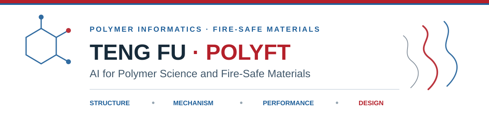

  

  <strong>Research Professor · Ph.D. Supervisor · Polymer Research Institute, Sichuan University</strong>

  <a href="https://pri.scu.edu.cn/info/1035/1606.htm">Academic Profile</a> ·
  <a href="https://scholar.google.com/citations?user=ubRZDWEAAAAJ">Google Scholar</a> ·
  <a href="https://orcid.org/0000-0002-2250-2453">ORCID</a> ·
  <a href="mailto:futeng@scu.edu.cn">Email</a>

I investigate how **polymer structure and composition govern degradation, combustion, safety, and sustainability**. My group integrates polymer chemistry, real-time combustion analysis, scientific instrumentation, and artificial intelligence to move materials research from empirical formulation toward mechanism-informed design.

## Research Architecture

| 01 · Structure | 02 · Mechanism | 03 · Performance | 04 · Design |
| :--- | :--- | :--- | :--- |
| Unified representations for homopolymers, copolymers, networks, blends, and composites | Quantitative analysis of pyrolysis, volatile evolution, gas-phase oxidation, and char formation | Fire safety, thermal protection, sensing, mechanics, and recyclability | Interpretable AI and experiments for transferable materials discovery |

My current work centers on **composition–mechanism–performance modeling** across thermoplastics, cross-linked polymers, and polymer composites. Multimodal combustion data are aligned along four mechanistic stages—**pyrolysis → volatile evolution → gas-phase oxidation → char formation**—to support causal interpretation and rational formulation design.

## Research Focus

<table>
  <tr>
    <td width="50%" valign="top">
      <h3>Polymer Intelligence</h3>
      
Unified polymer representations, evidence-linked literature data, interpretable structure–mechanism–property models, and AI-assisted materials design.

    </td>
    <td width="50%" valign="top">
      <h3>Fire-Safe Polymeric Materials</h3>
      
Molecular and formulation design of flame-retardant, intrinsically safe, thermal-protection, and high-performance polymer systems.

    </td>
  </tr>
  <tr>
    <td width="50%" valign="top">
      <h3>Combustion Science & Instrumentation</h3>
      
Real-time, in-situ analysis of polymer combustion, coupled optical–mass-spectrometric measurements, and mechanism-resolved datasets.

    </td>
    <td width="50%" valign="top">
      <h3>Sensing & Sustainable Polymers</h3>
      
Early-fire perception systems and recyclable or biomass-derived polymers designed for coordinated safety, performance, and circularity.

    </td>
  </tr>
</table>

## Selected Open Projects

<table>
  <tr>
    <td width="50%" valign="top">
      <h3><a href="https://github.com/PolyFT/Polymer-Literature-Data-Extraction">Polymer Literature Data Extraction</a></h3>
      
An LLM-assisted workflow that converts heterogeneous polymer literature into evidence-linked, sample-level structured data.

      
<code>LLM workflow</code> <code>traceable data</code>

    </td>
    <td width="50%" valign="top">
      <h3><a href="https://github.com/PolyFT/A-Component-Weighted-Local-Chemical-Motif-Representation-for-Unified-Polymer-Informatics">Component-Weighted Local Chemical Motifs</a></h3>
      
Composition-aware local chemical motifs for unified representation of homopolymers, copolymers, and polymer blends.

      
<code>RDKit</code> <code>polymer representation</code>

    </td>
  </tr>
  <tr>
    <td width="50%" valign="top">
      <h3><a href="https://github.com/PolyFT/Cone-calorimeter-combustion-data">Cone Calorimeter Combustion Data</a></h3>
      
Experiment-level cone-calorimeter records with raw measurements, oxygen time series, and IQR-processed oxygen-consumption data.

      
<code>open data</code> <code>combustion</code>

    </td>
    <td width="50%" valign="top">
      <h3><a href="https://github.com/PolyFT/Prompt-Writing-Methodology">Scientific Prompt Writing Methodology</a></h3>
      
A constraint-oriented framework for accountable, traceable, and reviewable use of large language models in scientific work.

      
<code>methodology</code> <code>research workflow</code>

    </td>
  </tr>
</table>

## Selected Research

### AI-Enabled Polymer & Fire-Safety Research

- **[Progress in Polymer Science · 2026](https://doi.org/10.1016/j.progpolymsci.2026.102153)** — Reaction-to-fire characterization data driving the AI-assisted design of flame-retardant polymeric materials. *Prog. Polym. Sci.* **180**, 102153.
- **[Accounts of Materials Research · 2025](https://doi.org/10.1021/accountsmr.5c00065)** — Design and development of fire-safety materials in artificial intelligence era. *Acc. Mater. Res.* **6**, 544–549.
- **[Research · 2024](https://doi.org/10.34133/research.0406)** — Scientific discovery framework accelerating advanced polymeric materials design. *Research* **7**, 0406.
- **[Polymer Degradation and Stability · 2024](https://doi.org/10.1016/j.polymdegradstab.2024.110981)** — Deeper insights into flame retardancy of polymers by interpretable, quantifiable, yet accurate machine-learning model. *Polym. Degrad. Stab.* **230**, 110981.

### Fire-Safe & Sustainable Polymeric Materials

- **[Nature Communications · 2025](https://doi.org/10.1038/s41467-025-64664-9)** — Biomimetic self-reinforcing recyclable biomass-derived inherently-safe sustainable materials. *Nat. Commun.* **16**, 9683.
- **[Materials Horizons · 2025](https://doi.org/10.1039/D5MH00878F)** — Thermally activated and fire-resistant thiol-Michael dynamic crosslinking networks for wildfire prevention. *Mater. Horiz.* **12**, 7463–7472.

### Combustion Analysis & Early-Fire Perception

- **[Journal of Hazardous Materials · 2024](https://doi.org/10.1016/j.jhazmat.2024.133914)** — Hazard evaluation of forest combustibles based on the correlation between pyrolysis products and combustion parameters. *J. Hazard. Mater.* **469**, 133914.
- **[Advanced Functional Materials · 2023](https://doi.org/10.1002/adfm.202210251)** — Bioinspired machine-learning-assisted early-fire perception system based on a VO₂ optical switch. *Adv. Funct. Mater.* **33**, 2210251.
- **[Advanced Functional Materials · 2022](https://doi.org/10.1002/adfm.202208131)** — A latent-fire-detecting olfactory system enabled by ultra-fast and sub-ppm ammonia-responsive Ti₃C₂Tₓ MXene/MoS₂ sensors. *Adv. Funct. Mater.* **32**, 2208131.
- **[Advanced Functional Materials · 2019](https://doi.org/10.1002/adfm.201806586)** — Bioinspired color-changing molecular sensor toward early fire detection based on transformation of phthalonitrile to phthalocyanine. *Adv. Funct. Mater.* **29**, 1806586.

<a href="https://scholar.google.com/citations?user=ubRZDWEAAAAJ">Complete publication record → Google Scholar</a>

## Collaboration

I welcome collaboration across **polymer science, fire safety, scientific instrumentation, sustainable materials, and artificial intelligence**. Prospective students interested in flame-retardant materials, combustion mechanisms, early-fire sensing, instrument development, or AI-assisted materials research are welcome to get in touch.

<strong>中文简介</strong>

付腾，四川大学高分子研究所研究员、博士生导师，主要从事火安全高分子材料、聚合物燃烧过程分析、火灾早期探测预警及人工智能辅助材料研发。研究工作贯通材料分子与配方设计、真实燃烧过程解析、仪器研制与预警器件开发，并进一步拓展至可循环、生物质来源高分子材料的安全与性能协同设计。

当前重点构建跨热塑性、交联及复合材料体系的“组成—机理—性能”模型，围绕热解、挥发分、气相氧化和炭化四个阶段形成可量化、可解释、可外推的机理表征与材料设计方法。

---

  <strong>From polymer structure to real-fire behavior · From mechanistic data to safer materials</strong>

